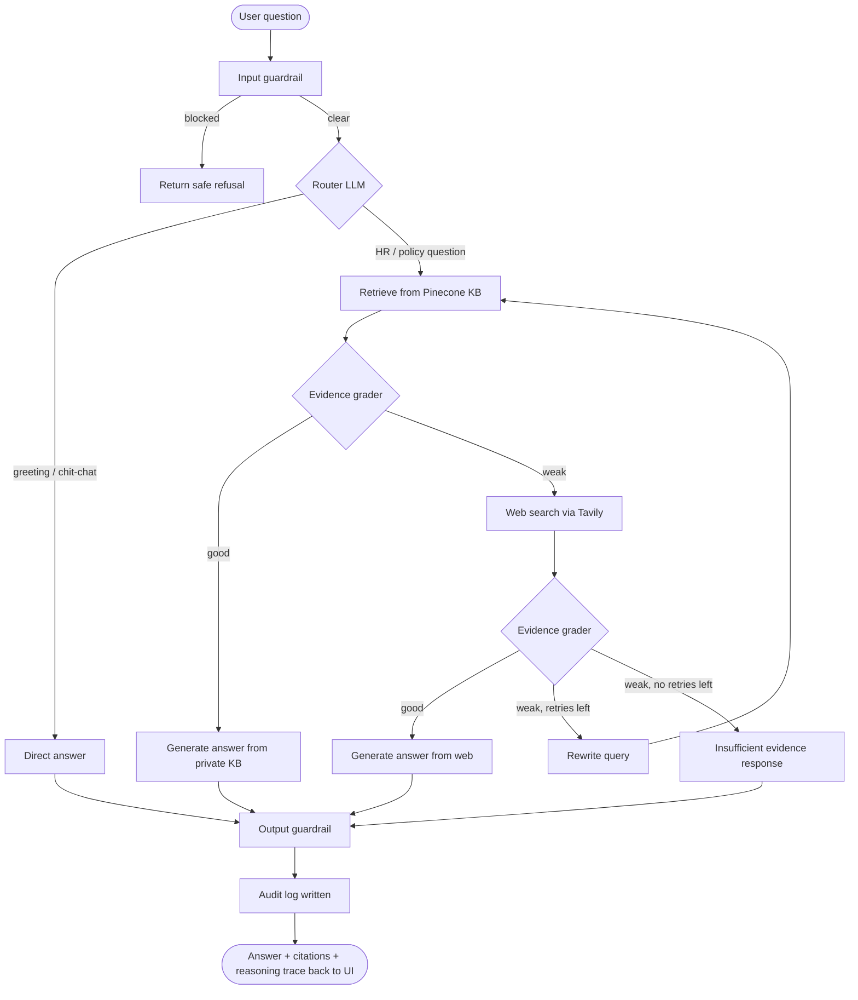

<div align="center">

# Enterprise RAG Agent
### HR Policy & Employee Support Copilot

**An agentic RAG system that answers HR questions from a private company knowledge base — and knows when to fall back to the web, and when to admit it doesn't know.**

[](https://www.python.org/)
[](https://fastapi.tiangolo.com/)
[](https://www.langchain.com/langgraph)
[](https://www.pinecone.io/)
[](https://react.dev/)
[](https://github.com/NVIDIA/NeMo-Guardrails)
[](#license)

</div>

---

## What this is

Most "chat with your docs" demos just retrieve and answer. This agent makes **decisions**.

It's a LangGraph-orchestrated agent that sits in front of a company's private HR knowledge base and behaves like a careful HR assistant, not a search box:

1. **Routes** every question — small talk gets a direct, on-brand reply; policy questions go to retrieval.
2. **Retrieves** from a private Pinecone-backed knowledge base (employee handbooks, policy PDFs/DOCX).
3. **Grades its own evidence** — an LLM judge checks whether what it retrieved is actually good enough to answer confidently.
4. **Falls back to live web search** (Tavily) when the private KB comes up short, and **rewrites the query** and retries if that's weak too.
5. **Refuses gracefully** — if nothing reliable turns up after retries, it says so instead of guessing.
6. **Guards input and output** with NeMo Guardrails content-safety checks before anything reaches the model or the user.
7. **Audits every interaction** to a local SQLite log — question, source used, reasoning trace, guardrail outcome.

The result ships with a full-stack, admin-uploadable, streaming-capable chat product — not just a script.

## 🗺️ How a question flows through the agent



Every response the UI receives includes the **source used** (`private_kb`, `web_search`, `direct`, or `insufficient_evidence`), the **citations**, and the **reasoning trace** — so nothing the agent decides is a black box.

## Features

- **Agentic routing & self-grading** — LangGraph state machine, not a fixed retrieve-then-generate chain
- **Private knowledge base retrieval** — Pinecone vector store with HuggingFace `all-MiniLM-L6-v2` embeddings
- **Web-search fallback with query rewriting** — retries with a better-phrased query before giving up
- **Guardrailed input/output** — NeMo Guardrails content-safety checks on both sides of the model
- **Document ingestion pipeline** — PDF, DOCX, TXT, and Markdown chunked and indexed via an admin-key-protected endpoint
- **Full audit trail** — every question, answer source, guardrail verdict, and reasoning trace logged to SQLite
- **Production-ready chat UI** — React + Tailwind, light/dark mode, Markdown rendering, collapsible reasoning trace, conversation history, admin document upload panel
- **Single-container deploy** — multi-stage Dockerfile builds the frontend and serves it straight from FastAPI

##  Architecture

```
Enterprise-RAG-Agent/
├── Agent/            # LangGraph state machine — routing, grading, generation
│   ├── workflow.py
│   └── state.py
├── RAG/               # Ingestion + vector store
│   ├── Ingestion_pipeline.py
│   ├── vector_store.py
│   └── embeddings_deletion.py
├── GuardRails/        # NeMo Guardrails config + input/output checks
│   ├── rails.py
│   └── Config/
├── api/                # FastAPI routes (/chat, /ingest, /health)
├── app/
│   ├── core/           # Settings, logging
│   └── services/       # Audit logging (SQLite)
├── frontend/           # React + Tailwind chat UI (Vite)
├── Data/                # Audit DB + sample knowledge base
├── main.py              # FastAPI app entrypoint, serves built frontend
└── Dockerfile            # Multi-stage build: frontend → backend
```

## Tech stack

| Layer | Technology |
|---|---|
| Agent orchestration | LangGraph, LangChain |
| LLM | Google Gemini (`gemini-3.5-flash-lite` via `langchain-google-genai`) |
| Vector store | Pinecone (`langchain-pinecone`) |
| Embeddings | `sentence-transformers/all-MiniLM-L6-v2` |
| Web search fallback | Tavily |
| Guardrails | NVIDIA NeMo Guardrails |
| Backend API | FastAPI, Uvicorn |
| Document parsing | PyMuPDF (PDF), python-docx (DOCX) |
| Audit logging | SQLite |
| Frontend | React 18, Tailwind CSS, Vite, `react-markdown` |
| Deployment | Docker (multi-stage build) |

## Getting started

### Prerequisites

- Python 3.12+
- Node.js 20+ (for the frontend)
- A [Pinecone](https://www.pinecone.io/) API key
- A [Google AI](https://ai.google.dev/) API key (Gemini)
- A [Tavily](https://tavily.com/) API key (web search fallback)

### 1. Clone and configure

```bash
git clone https://github.com/Sharksurya006/Enterprise-RAG-Agent.git
cd Enterprise-RAG-Agent
```

Create a `.env` file in the project root:

```env
GOOGLE_API_KEY=your_google_api_key
PINECONE_API_KEY=your_pinecone_api_key
TAVILY_API_KEY=your_tavily_api_key
ADMIN_API_KEY=choose_a_strong_admin_key
```

### 2. Install backend dependencies

```bash
pip install -r requirements.txt
# or, using uv:
uv sync
```

### 3. Index the sample knowledge base (optional)

```bash
python ingest_sample_kb.py
```

### 4. Run the backend

```bash
uvicorn main:app --reload
```

The API is now live at `http://localhost:8000` — check `http://localhost:8000/api/health`.

### 5. Run the frontend (development)

```bash
cd frontend
npm install
npm run dev
```

Vite serves the UI at `http://localhost:5173` and proxies `/api/*` to the backend on port 8000.

### 6. Production build

```bash
cd frontend && npm run build
```

This outputs static files to `frontend/dist/`, which `main.py` serves directly — so in production you only need to run the FastAPI server.

### Or, run it all in Docker

```bash
docker build -t enterprise-rag-agent .
docker run -p 8080:8080 --env-file .env enterprise-rag-agent
```

## 🔌 API

| Method | Endpoint | Description |
|---|---|---|
| `GET` | `/api/health` | Service health check |
| `POST` | `/api/chat` | Ask a question — returns `answer`, `source_used`, `trace`, `citations`, `rewritten_query` |
| `POST` | `/api/ingest` | Upload a document (`multipart/form-data`) to the KB — requires `X-Admin-Key` header |

**Example:**

```bash
curl -X POST http://localhost:8000/api/chat \
  -H "Content-Type: application/json" \
  -d '{"question": "How many paid leave days do I get per year?"}'
```

##  Roadmap

- [ ] Semantic caching layer (Redis) to cut latency and repeated LLM cost on similar queries
- [ ] Streaming responses to the frontend
- [ ] Multi-tenant knowledge bases

##  Contributing

Issues and PRs are welcome — this is an active learning/portfolio project, so feedback on the agent design is especially appreciated.

##  License

_Add a license (MIT is a common default for portfolio projects) — none is currently specified in the repo._

---

<div align="center">
Built by <a href="https://github.com/Sharksurya006">Surya S</a>
</div>